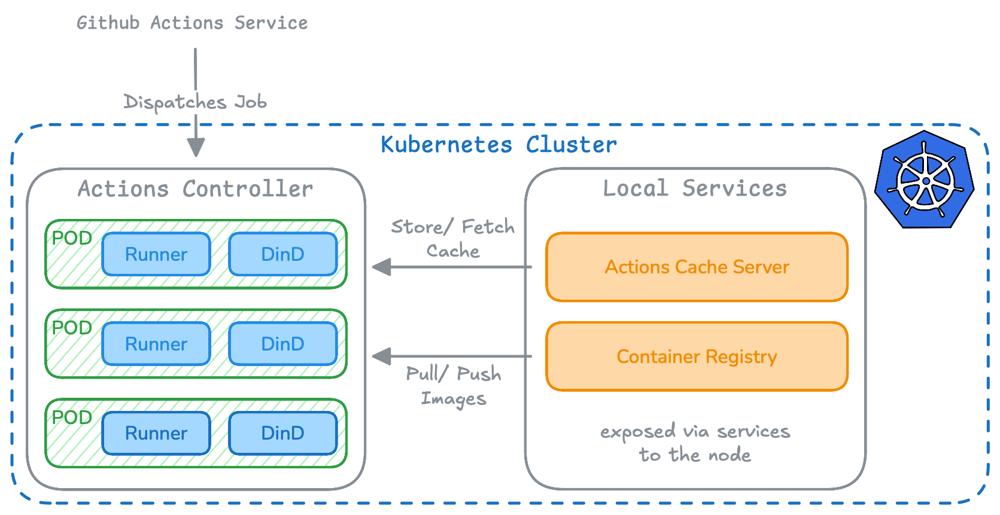

# Actions Runner Stack

This repository documents our self‑hosted GitHub Actions runner setup using ARC (Actions Runner Controller). It is designed to run multiple GitHub Actions simultaneously on our infrastructure with minimal operational effort, while keeping the environment consistent and close to where our code and services live.

## Background

As NoScrubs’ CI/CD usage grew, cost became a major driver and external image pulls and cache traffic became bottlenecks. We adopted ARC alongside an on‑prem container registry and a custom Actions cache server to keep artifacts local and improve build speed and reliability. This repository captures the current approach used at NoScrubs, while leaving room to evolve as our platform changes.

This helps us achieve faster build times with local caching, reduced CI/CD cost, and more control over the Actions runtime.

## Architecture

This repository applies ARC to build a self‑hosted runner system with a few concrete components: ARC, runner pods with DinD, a local registry, and a local Actions cache server. The goal is to keep builds and artifacts inside the cluster while still using GitHub Actions as the control plane.

Components

- **ARC**: ARC runs inside the cluster and owns the runner scale set. It receives job demand from GitHub and creates short‑lived runner pods for each job, then cleans them up when the job completes.

- **Runner pods (runner + DinD)**: Each runner pod contains the GitHub runner container and a DinD sidecar. The runner container executes the workflow, while the DinD sidecar provides a Docker daemon for image builds and containerized steps.

- **Local registry**: The registry serves runner images and dependency layers to the runner pods. The runner container pulls images from the registry over in‑cluster networking, keeping image traffic local and reducing external dependency.

- **Actions cache server**: The cache server handles Actions cache traffic so workflow caches are stored and retrieved locally. The runner container talks to the cache server via its in‑cluster URL during `actions/cache` operations, which reduces latency and build time.

## Requirements

A Kubernetes cluster and Helm 3 are required.

## Quickstart

Use the official ARC [quickstart guide](https://docs.github.com/en/actions/tutorials/use-actions-runner-controller/quickstart) to install the controller and a runner scale set.

## Setup

For the full setup used here (ARC + local registry + local cache server), see [docs/setup.md](docs/setup.md).

## References

- [ARC documentation](https://docs.github.com/en/actions/concepts/runners/actions-runner-controller)
- [ARC quickstart guide](https://docs.github.com/en/actions/tutorials/use-actions-runner-controller/quickstart)
- [Falcon GitHub Actions Cache Server](https://gha-cache-server.falcondev.io/getting-started/)
